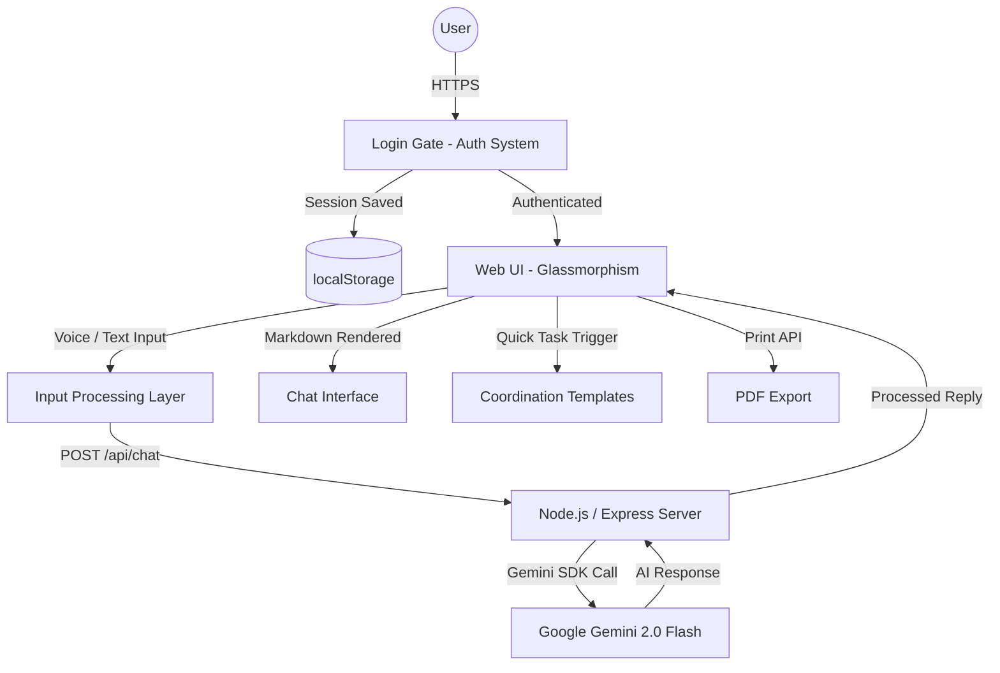

# 🤝 UnityAid AI: Smart Volunteer Coordination Platform

UnityAid AI is a premium, AI-powered community coordination platform designed to empower volunteers and NGOs across India with intelligent planning tools, real-time AI assistance, and seamless resource management.

##  Key Features
- ** Smart AI Assistant:** Powered by Google Gemini 2.0 Flash, providing real-time, accurate guidance for organizing food drives, blood donation camps, emergency response operations, and community events.
- ** Secure Authentication Gate:** Built-in Sign Up / Login system with localStorage-based session management — fully client-side, zero backend dependency.
- ** Quick Task Templates:** One-tap access to predefined AI coordination plans for the most common volunteer scenarios.
- ** Voice Input Support:** Hands-free query submission using the Web Speech API — accessible and fast.
- ** Persistent Chat History:** All AI conversations are saved locally, ensuring continuity across sessions.
- ** Export to PDF:** Save and share AI-generated coordination plans directly as printable PDF documents.
- ** Dark / Light Mode:** Seamless theme switching with instant visual feedback.
- ** Fully Mobile Responsive:** Optimized sidebar navigation and layout for phones, tablets, and desktops.

##  Technology Stack
- **Frontend:** Vanilla HTML5, CSS3 (Glassmorphism design, micro-animations), Modern JavaScript (ES6+).
- **Backend:** Node.js, Express.js.
- **AI Engine:** Google Gemini 2.0 Flash (`@google/generative-ai`).
- **Deployment:** Docker, Google Cloud Run.
- **Storage:** Browser localStorage (client-side persistence).

##  Setup & Installation
1. Clone the repository.
2. Install dependencies: `npm install`.
3. Create a `.env` file with your `GEMINI_API_KEY`.
4. Run the app: `npm start`.
5. Access via: `http://localhost:8080`.

## 🏗️ Technical Architecture


## 📂 Project Structure
```text
UnityAid-AI/
├── public/             # Frontend assets (HTML, CSS, JS, Logo)
├── server.js           # Express backend + Gemini API integration
├── package.json        # Project metadata & dependencies
├── Dockerfile          # Containerization for Google Cloud Run
├── .env                # Environment variables (API key)
├── .gitignore          # Git ignore rules
└── README.md           # Project documentation
```

## 🛡️ Security & Technical Excellence
- **Official Google AI SDK:** Integrated `@google/generative-ai` for robust, production-ready Gemini 2.0 Flash interactions.
- **Environment Variable Protection:** API keys are stored securely in `.env` — never exposed in frontend code.
- **Input Validation:** All user inputs are validated client-side before being sent to the backend.
- **CORS Enabled:** Cross-origin requests handled safely for multi-device local network access.
- **Error Fallback System:** Smart offline fallback responses keep the app functional even when the API is temporarily unreachable.
- **Docker Ready:** Containerized with a minimal `node:20-alpine` image for efficient, fast Cloud Run deployments.

## 🇮🇳 Why it matters?
With over **1.4 billion people**, India has one of the world's largest volunteer communities — yet coordination is still largely unorganized, fragmented, and slow. During disasters, blood shortages, or local crises, the absence of real-time planning tools costs lives and resources.

UnityAid AI bridges this critical gap by providing every volunteer and NGO with an AI-powered coordination command center that can plan a food drive in seconds, match blood donors to hospitals, and generate emergency response frameworks on demand.

---

## 🔗 Live Demo
[🌐 Visit UnityAid AI Live](https://unity-aid-3sph6xrxi-mohd-ubess-projects.vercel.app)
